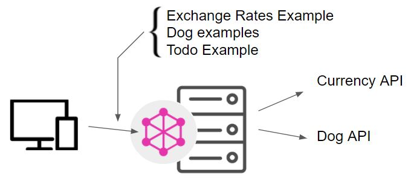

Combined server meant to be run locally, for some of the Apollo Client Exercises given [here](https://www.apollographql.com/docs/react/get-started/)

Observe, that even though this example is very simple (only one file) it does visualize a realistic GraphQL Architecture where the server forwards incomming (graphQL) requests to external servers as visualized below.

## Architecture for this simple GraphQL-server

